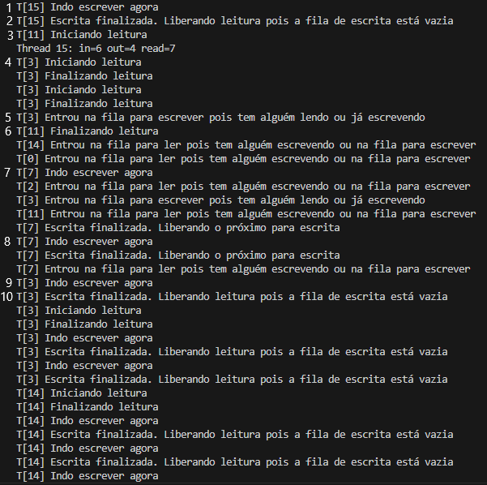

**OBJETIVO DO EXERCÍCIO:** Usar o padrão leitores e escritores com prioridade para operações de escrita.

**INSTRUÇÕES PARA RODAR O CÓDIGO (Preferencialmente ambiente Linux):**

>1 - Abra o terminal
>
>2 - Navegue até a pasta de sua preferência que irá receber o código 
>
>3 - Cole o comando ```git clone https://github.com/victorpss/Programacao-Concorrente-24.2.git```
>
>4 - Entre na pasta com o comando ```cd Programacao-Concorrente-24.2/Lab6```
>
>5 - Compile o programa com o comando ```gcc -o [nome] lab6.c list_int.c -Wall```, substituindo [nome] com o nome de sua preferência para o arquivo executável que será gerado.
>
>6 - Rode o programa com ```./[nome] [nthreads]```, substituindo [nome] pelo nome do executável escolhido e [nthreads] pela quantidade de threads que o programa irá conter. Exemplo: ```./lab 20```
>
>7 - Visualize o terminal e perceba a ordem das operações sendo executadas ou entrando em fila.

<br></br>
**Análise:** O programa escrito deverá respeitar a prioridade das operações de escrita, isto é, sempre que existir thread realizando escrita ou thread(s) na fila para escrita, novas operações de leitura não podem começar. Para isso, algumas condições são verificadas para garantir tal objetivo:
- Para iniciar uma escrita, deverá ser verificado se alguma thread está realizando a escrita ou a leitura. Caso positivo, essa thread é bloqueada com o comando ```pthread_cond_wait``` e entra na fila de escrita. Caso contrário, ela pode iniciar a escrita.
- Para iniciar uma leitura, deverá ser verificado se alguma thread está realizando a escrita ou se existem threads na fila para escrever, pois a prioridade é delas. Caso positivo, a thread é bloqueada com o comando ```pthread_cond_wait``` e entra na fila para leitura (e só lê após o esgotamento da fila de escrita). Caso contrário, ela pode iniciar a leitura.
- Para finalizar uma escrita, deverá ser verificado se tem alguém na fila de escrita. Caso positivo, através do comando ```pthread_cond_signal```, a próxima thread na fila será liberada para realizar escrita. Caso contrário, posso liberar a leitura para todas as threads na fila de leitura com o comando ```pthread_cond_broadcast```.
- Para finalizar uma leitura, verifica-se o novo número de leitores. Se for 0, libera uma thread na fila de escrita com o comando ```pthread_cond_signal```.

<br></br>
**Recorte das execuções:**


- Em 1, a thread 15 entra para iniciar uma escrita.
- Em 2 e 3, as threads 18 e 19 tentam iniciar leitura, mas como a 15 está escrevendo, elas entram na fila de leitura e serão desbloqueadas quando não tiver ninguém escrevendo ou na fila de escrita.
- Em 4, a thread 0 termina a leitura que começou antes do início da escrita da thread 15.
- Em 5, a thread 0 entra na fila da escrita.
- Até 6, threads entram na fila de leitura/escrita e leituras (que iniciaram antes da escrita da 15) terminam.
- Em 6, a thread 15 termina a escrita e libera para a próxima da fila (thread 0).
- Em 7, a thread 0 inicia a escrita.
- Em 8, a thread 0 termina a escrita e libera para a próxima da fila (thread 3)
- Em 9, a thread 3 inicia a escrita.
- Em 10, a thread 3 termina a escrita e libera para a próxima da fila (thread 7)

Posteriormente, quando todas as threads na fila de escrita terminam a escrita, todas as thread na fila de leituras são liberadas para realizarem a leitura.
